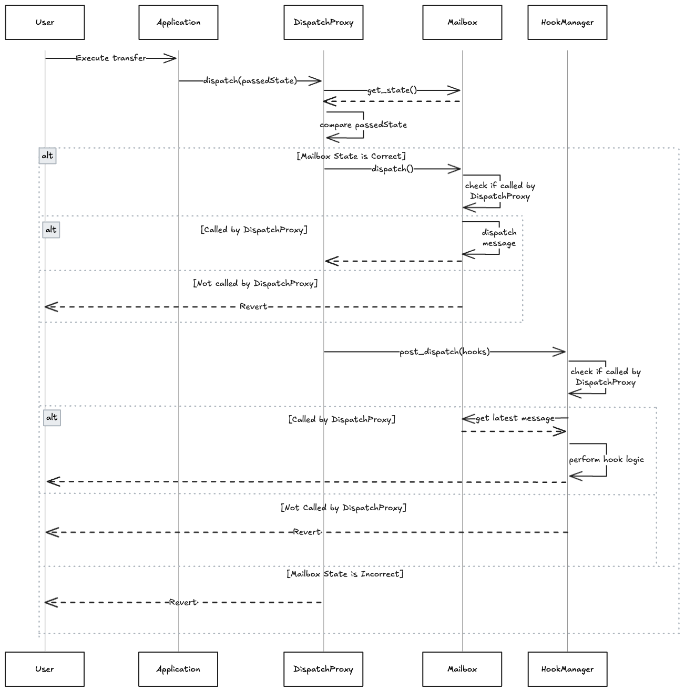
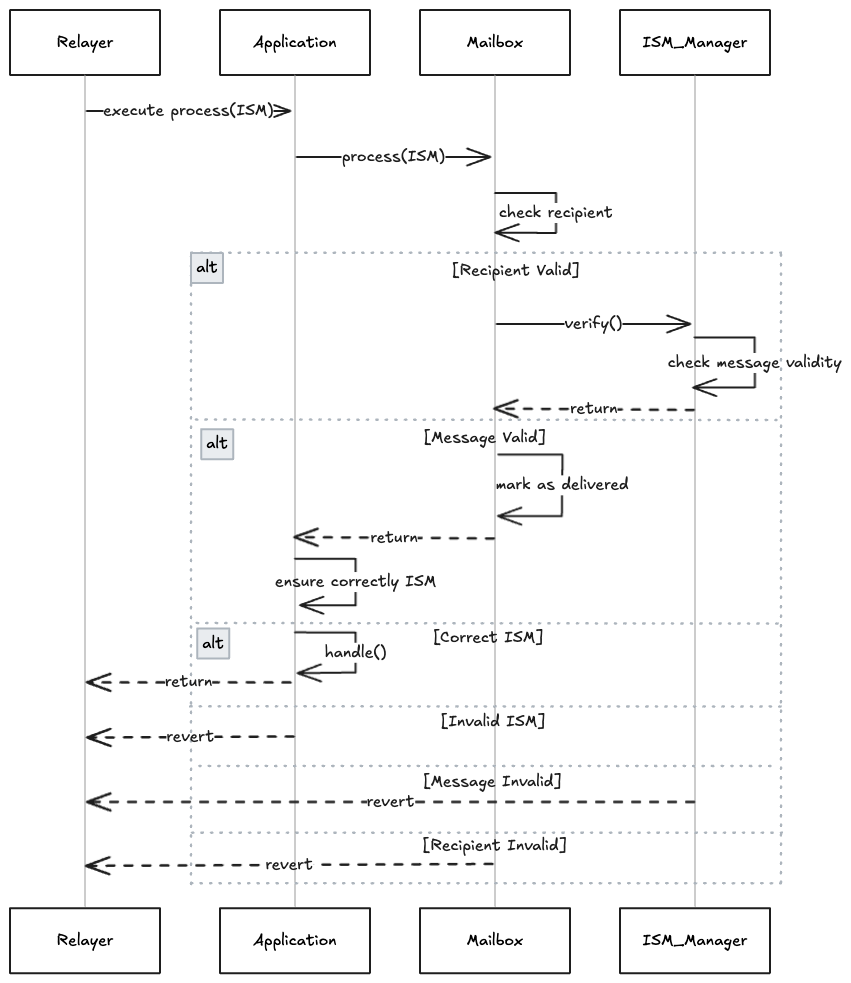

# Hyperlane-Aleo

> [!WARNING]  
> This project is currently under development and not intended to be used in production.

This project is an implementation of Hyperlane for the Aleo, designed for
a seamless interchain communication following the Hyperlane spec.

## [dispatch_proxy/src](./dispatch_proxy/src)

`dispatch_proxy` is a lightweight contract that acts as an intermediary for dispatching messages to the mailbox. It organizes the dispatch process, ensuring that `post_dispatch` hooks are correctly invoked. It allows users to dispatch messages without having to specify explicit mailbox state that might change with each dispatch.

## [hook_manager/src](./hook_manager/src)

`hook_manager` implements the hook management system for Hyperlane on Aleo. It provides functionality for registering, executing, and managing post-dispatch hooks that are called after message dispatch operations. The hook manager coordinates between different hook types including merkle tree hooks for message verification and other custom hooks that extend the protocol's capabilities.

## [ism_manager/src](./ism_manager/src)

`ism_manager` implements the Interchain Security Module (ISM) management system for message verification on Aleo. It handles the validation of incoming messages by coordinating with various ISM types including multisig ISMs for signature verification and other security modules. The ISM manager ensures that only properly authenticated messages are processed, providing the security foundation for cross-chain communication.

## [mailbox/src](./mailbox/src)

`mailbox` implements the core message passing functionality for Hyperlane on Aleo. It serves as the central hub for dispatching outbound messages and processing inbound messages. The mailbox coordinates with both the hook manager for post-dispatch operations and the ISM manager for message verification, providing a unified interface for cross-chain message delivery and execution.

## [validator/src](./validator/src)

`validator` implements a Hyperlane Validator Announce contract, allowing validators to announce their storage locations.

## Development

Getting started:

Install the latest version of the leo compiler.

```bash
# Download the source code.
> git clone https://github.com/ProvableHQ/leo.git && cd leo

# Install the compiler.
> cargo install --path .

# Run the compiler.
> leo ...
```

**Building the project:**

```bash
cd mailbox
leo build
```

**Running tests:**

```bash
# Install python requirements
pip3 install -r requirements.txt

# Run tests
python3 -m pytest -s -vv --log-cli-level=INFO
```

**Running a local devnet:**

This is required when running tests locally.

```bash
# Download the source code
> git clone https://github.com/ProvableHQ/leo.git && cd leo

# Checkout the feature branch
> git checkout feat/leo-devnode

# Install leo with features
> cargo install --path .

# Run the devnet
> leo devnode start

# Advancing blocks
> leo devnode advance 10
```

## Architecture

There are some key differences between the Aleo implementation and other Hyperlane implementations:

- **Mailbox interaction**: The entrypoint for dispatching and processing messages is now on the Application level (i.e., the `hyp_token` contract) rather than directly on the mailbox contract. This ensures a dynamic interaction with the mailbox, even though the AVM does not support dynamic contract calls.
- **Hooks**: Aleo uses a static hook manager contract to manage all hooks, because the AVM does not support dynamic contract calls. This limits the possibility of user-defined hooks, but allows us to implement the core hook types defined by Hyperlane while maintaining some level of flexibility.
- **ISM Verification**: Similar to hooks, ISM verification is handled by a static ISM manager contract.
- **Dispatch Proxy**: The AVM does not support contract calls based on dynamic state, so we introduce a dispatch proxy contract that acts as an intermediary and coordinates the dispatch process. This allows hooks to query mailbox state without requiring users to provide it during dispatch.
- **Message Processing**: Remote messages might be of varying sizes, because the AVM doesn't support dynamic arrays, we have to pass the message length as an additional parameter when processing messages. Additionally, we have to cut down on the maximum message size and its resolution to fit within the constraints of the AVM. See the `mailbox` contract for details [here](./mailbox/src/main.leo).

### Dispatch flow



### Process flow



## Open Issues

- [x] `merkle_tree_hook` use `keccak`
- [x] Use `u128` for byte arrays
- [x] Hook usage: Figure out a way for dynamic `credit_amounts` when calling hooks
- [x] Verify Signatures dynamically in `ism_manager`
- [x] Finish Process & Dispatch logic
- [x] Validator Announce
- [x] Correct Events for agents
- [ ] `hyp_token_manager`
- [x] Add CI/CD pipeline

## License

This project is licensed under the Apache License, Version 2.0.  
See the [LICENSE](LICENSE) file for the full terms.

Copyright 2025 Abacus Works, Inc.
